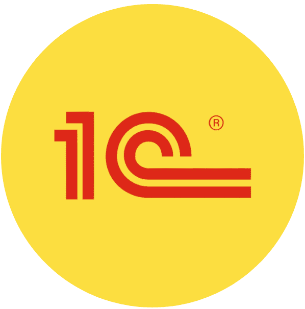

  <h3>👨‍💻 Обо мне</h3>
  
  

    Я <b>Набиюлла</b> — 1С-разработчик с 2-х летним опытом в системном администрировании и 5 летним опытом коммерческой 1С разработки (по настоящее время). 
    Создаю эффективные решения для автоматизации бизнеса, от небольших доработок до сложных интеграций.
  

  <!-- Навыки -->
  

    <h4 style="margin: 0 0 12px; text-align: center; font-size: 16px;">🛠 Навыки</h4>
    <ul style="list-style: none; padding: 0; margin: 0; font-size: 14px; line-height: 1.8;">
      <li style="padding-left: 16px; border-left: 3px solid #2563eb; margin: 8px 0;">1С:Предприятие 8.3 (УТ, ЗУП, БП, КА, ERP и др.)</li>
      <li style="padding-left: 16px; border-left: 3px solid #2563eb; margin: 8px 0;">Библиотека стандартных подсистем (БСП)</li>
      <li style="padding-left: 16px; border-left: 3px solid #2563eb; margin: 8px 0;">Управляемые и обычные формы</li>
      <li style="padding-left: 16px; border-left: 3px solid #2563eb; margin: 8px 0;">Запросы, СКД, оптимизация производительности</li>
      <li style="padding-left: 16px; border-left: 3px solid #2563eb; margin: 8px 0;">HTTP/REST/JSON интеграции</li>
      <li style="padding-left: 16px; border-left: 3px solid #2563eb; margin: 8px 0;">Работа с PostgreSQL и MS SQL</li>
      <li style="padding-left: 16px; border-left: 3px solid #2563eb; margin: 8px 0;">Git для 1С</li>
    </ul>
  

  <!-- Фриланс -->
  

    

      🔗 <b>Ищете исполнителя?</b> Ссылки на мои профили на фриланс-площадках — в шапке профиля 👈
    

  

  <!-- Хобби -->
  

    <h4 style="margin: 0 0 12px; font-size: 16px;">🎯 Хобби и интересы</h4>
    

      • Участвую в опенсорс-проектах по 1С 
      • Люблю решать сложные технические задачи 
      • В свободное время играю в <a href="https://www.chess.com/member/thenabiulla" target="_blank" rel="noopener">Шахматы♚</a> и <a href="https://www.leagueofgraphs.com/summoner/ru/Nabiulla-RU1" target="_blank" rel="noopener">League of Legends🎮</a>
    

  

  <!-- Контакты -->
  

    <h4 style="margin: 0 0 12px; font-size: 16px;">📬 Связаться со мной</h4>
    
✉️ Email: snm.supreme@yandex.ru

    
✉️ Telegram, Max: Ссылки на чаты ниже, меня можно найти в любом из них👇

  

  <h3>Мои проекты (Списки репозиториев)</h3>
  <table align="center">
    <tr>
      <td align="center" valign="top" style="padding: 0 12px;">
        
        <h4 style="font-size: 14px;">1C</h4>
      </td>
      <td align="center" valign="top" style="padding: 0 12px;">
        
        <h4 style="font-size: 14px;">Python</h4>
      </td>
    </tr>
  </table> 

  <h3>Вступайте в открытый чат по 1С Разработке</h3>
  <table align="center">
    <tr>
      <td align="center" valign="top" style="padding: 0 12px;">
        
        <h4 style="font-size: 14px;">Telegram</h4>
      </td>
      <td align="center" valign="top" style="padding: 0 12px;">
        
        <h4 style="margin: 6px 0 0; font-size: 14px;">Max</h4>
      </td>
    </tr>
  </table> 

  <b><i>Общаемся, делимся мыслями, разработками и полезными материалами!</i></b>

